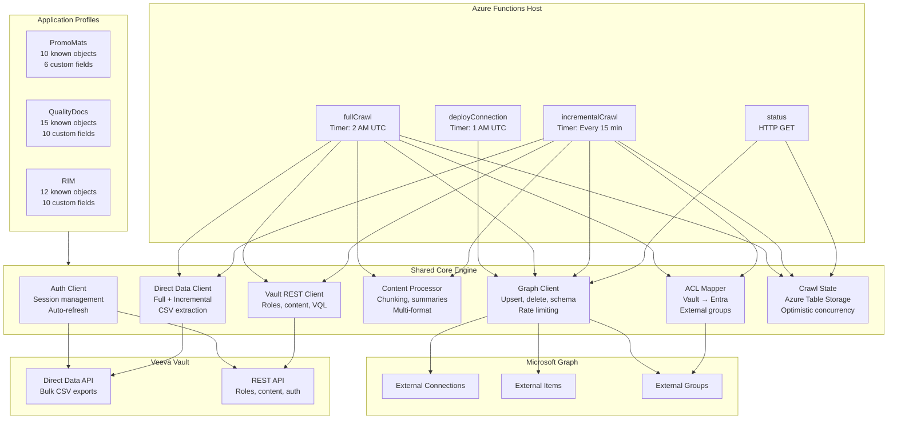
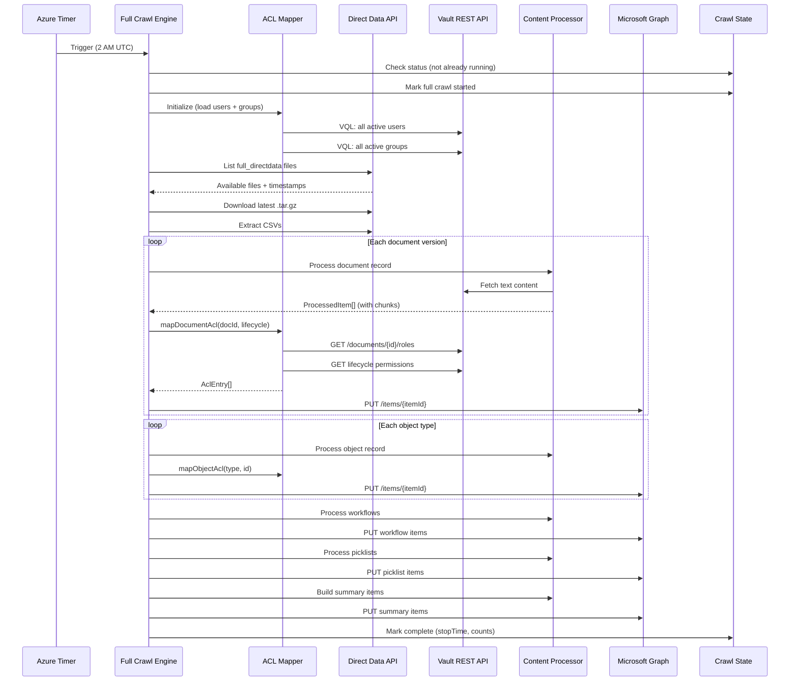
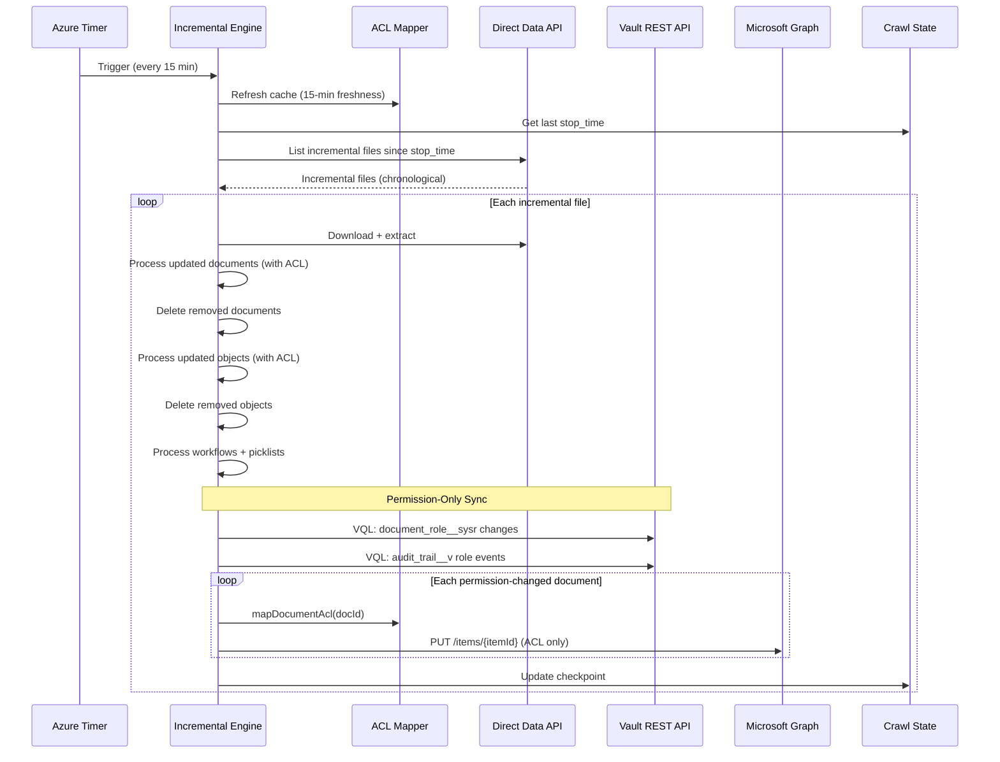
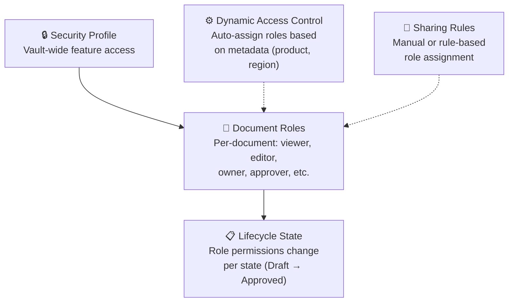
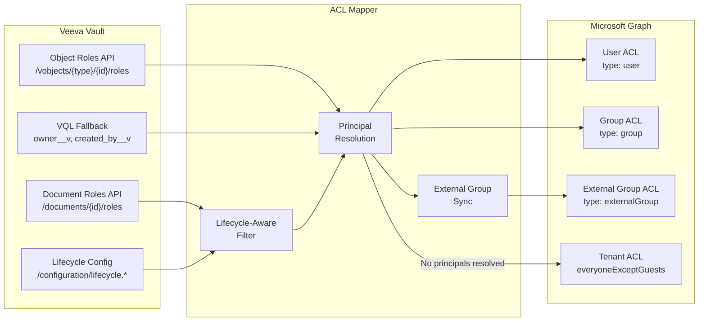

# Veeva Vault Unified Copilot Connector

A unified Microsoft 365 Copilot connector for Veeva Vault that indexes content from **PromoMats**, **QualityDocs**, and **RIM** into the Microsoft Graph. Built with the M365 Agents Toolkit (TypeScript / Azure Functions v4), powered by the Veeva Direct Data API with 15-minute incremental crawl.

> **Best Practices Compliance** — This connector was built in full compliance with the [Custom Copilot Connector Best Practices](https://github.com/boddev/CustomCopilotConnectorBestPractices) guide (43/43 requirements met). See the [Best Practices Compliance](#best-practices-compliance) section for details.

> **📘 Setup Guide** — For complete deployment instructions (from zero to production), see [Setup.md](./Setup.md). For SSO configuration between Microsoft Entra ID and Veeva Vault, see [SingleSignOn-Setup.md](./SingleSignOn-Setup.md).

---

## Table of Contents

- [Overview](#overview)
- [Architecture](#architecture)
- [Data Flow](#data-flow)
- [Supported Vault Applications](#supported-vault-applications)
- [Supported Entity Types](#supported-entity-types)
- [Supported Veeva Formats & Content Types](#supported-veeva-formats--content-types)
- [Graph API Version (v1.0 vs Beta)](#graph-api-version-v10-vs-beta)
- [Schema Properties](#schema-properties)
- [Permissions & Access Control](#permissions--access-control)
- [Crawl Engines](#crawl-engines)
- [Long-Running Crawls & Enterprise Scale](#long-running-crawls--enterprise-scale)
- [Crawl Scheduling](#crawl-scheduling)
- [Admin Dashboard](#admin-dashboard)
- [Veeva APIs Used](#veeva-apis-used)
- [Microsoft Graph APIs Used](#microsoft-graph-apis-used)
- [Azure Functions Endpoints](#azure-functions-endpoints)
- [Declarative Agents](#declarative-agents)
- [Multi-Application Deployment](#multi-application-deployment)
- [Content Chunking](#content-chunking)
- [Best Practices Compliance](#best-practices-compliance)

---

## Overview

This connector indexes Veeva Vault content into Microsoft 365 Copilot via the Microsoft Graph External Connections API. It supports three Veeva Vault applications from a single unified codebase:

| Capability | Detail |
|---|---|
| **Vault Applications** | PromoMats, QualityDocs, RIM |
| **Data Source** | Veeva Direct Data API (bulk CSV extracts) |
| **Graph API Version** | v1.0 (default) or Beta — configurable via `GRAPH_API_VERSION` |
| **Full Crawl** | Weekends by default (configurable day-of-week) |
| **Incremental Crawl** | Every 15 minutes (configurable) |
| **Content Freshness** | ~15 minutes |
| **Enterprise Scale** | Supports 10M+ documents; unlimited crawl duration with progress tracking |
| **Entity Types** | Documents, objects, relationships, workflows, picklists, summaries |
| **Object Discovery** | Auto-discovers custom objects from Direct Data manifest |
| **Known Object Types** | 40+ across all three applications |
| **Schema Properties** | 47 base + up to 10 per-app extensions |
| **Permission Model** | Per-item ACLs from Vault roles, lifecycle-aware, external group sync |
| **Content Chunking** | Automatic for documents > 3.5 MB (4 MB Graph limit) |
| **Concurrency** | Max 8 parallel Graph API calls with rate-limit backoff |
| **Admin Dashboard** | Built-in web UI for monitoring progress, triggering crawls, and viewing status |
| **Runtime** | Azure Functions v4 (Premium/Dedicated plan), Node.js 20+, TypeScript 5.5+ |

---

## Architecture



### Component Responsibilities

| Component | File | Responsibility |
|---|---|---|
| **Auth Client** | `src/veeva/authClient.ts` | Vault session authentication with auto-refresh and retry |
| **Direct Data Client** | `src/veeva/directDataClient.ts` | Download, extract, and parse Direct Data archives |
| **Vault REST Client** | `src/veeva/vaultRestClient.ts` | Document content, roles, VQL queries, lifecycle config |
| **Content Processor** | `src/crawl/contentProcessor.ts` | Transform Vault records to Graph items with chunking |
| **ACL Mapper** | `src/graph/aclMapper.ts` | Map Vault roles → Entra principals with external groups |
| **Graph Client** | `src/graph/graphClient.ts` | Create connections, register schema, upsert/delete items |
| **Crawl State** | `src/crawl/crawlState.ts` | Persist progress in Azure Table Storage |
| **Object Discovery** | `src/crawl/objectDiscovery.ts` | Auto-detect custom object types from manifest |
| **App Profiles** | `src/config/appProfiles.ts` | Per-application schema extensions and known objects |
| **Settings** | `src/config/settings.ts` | Environment-based configuration with validation |

---

## Data Flow

### Full Crawl Flow



### Incremental Crawl Flow



---

## Supported Vault Applications

### PromoMats

Indexes promotional content including claims, key messages, brand assets, and campaign materials across the marketing and medical review lifecycle.

| Category | Known Object Types |
|---|---|
| **Products** | `product__v` |
| **Marketing** | `campaign__v`, `key_message__v`, `claim__v`, `material__v` |
| **Audience** | `audience__v`, `channel__v` |
| **Medical** | `indication__v`, `therapeutic_area__v` |
| **Geography** | `country__v` |

**App-Specific Schema Fields:** `keyMessages`, `claim`, `audience`, `channel`, `mlrStatus`, `promotionalType`

### QualityDocs

Indexes quality management content including SOPs, work instructions, CAPAs, deviations, complaints, audits, and controlled documents.

| Category | Known Object Types |
|---|---|
| **Core Quality** | `quality_event__v`, `deviation__v`, `capa__v`, `complaint__v` |
| **Change Management** | `change_control__v`, `document_change_control__v` |
| **Compliance** | `audit__v`, `lab_investigation__v`, `periodic_review__v`, `controlled_copy__v` |
| **Training** | `training_requirement__v`, `training_assignment__v` |
| **Organization** | `product__v`, `country__v`, `facility__v` |

**App-Specific Schema Fields:** `effectiveDate`, `periodicReviewDate`, `trainingRequired`, `facility`, `department`, `qualityEventType`, `capaNumber`, `deviationNumber`, `complaintNumber`, `changeControlNumber`, `auditType`

### RIM (Regulatory Information Management)

Indexes regulatory submissions, registrations, dossiers, health authority correspondence, and compliance documents.

| Category | Known Object Types |
|---|---|
| **Submissions** | `application__v`, `submission__v`, `regulatory_objective__v` |
| **Registrations** | `registration__v`, `active_dossier__v` |
| **Health Authorities** | `health_authority__v`, `health_authority_interaction__v` |
| **Content Planning** | `content_plan__v`, `content_plan_item__v` |
| **Events** | `regulatory_event__v` |
| **Organization** | `product__v`, `country__v` |

**App-Specific Schema Fields:** `applicationNumber`, `submissionType`, `regulatoryObjective`, `registrationStatus`, `healthAuthority`, `dossierSection`, `contentPlanItem`, `marketCountry`, `submissionDate`, `approvalDate`

---

## Supported Entity Types

The connector indexes six distinct entity types into the Microsoft Graph:

| Entity Type | Source | Item ID Pattern | Description |
|---|---|---|---|
| **Document** | `document_version__sys.csv` | `doc-{versionId}` | Full document versions with metadata, content text, and per-item ACL |
| **Relationship** | `document_relationship__sys.csv` | `rel-{relationshipId}` | Cross-document links with source/target IDs and relationship type |
| **Object** | `{objectType}.csv` | `obj-{objectType}-{id}` | Custom Vault object records (CAPAs, submissions, products, etc.) |
| **Workflow** | `workflow__sys.csv` | `wf-{workflowId}` | Workflow task instances with status, type, due date, and owner |
| **Picklist** | `picklist__sys.csv` | `picklist-{object}-{field}-{value}` | Field value options used across object metadata |
| **Summary** | Computed at crawl time | `summary-{type}-{app}-{date}` | Pre-computed aggregations (document counts by status, type) |

### Auto-Discovery

When `AUTO_DISCOVER_OBJECTS=true` (default), the connector automatically detects additional custom object types from the Direct Data manifest CSV. Any object with a `__v` (Veeva standard) or `__c` (customer custom) suffix is discovered and indexed alongside the known object types for the selected application.

---

## Supported Veeva Formats & Content Types

### Document Formats

The connector extracts text content from all Vault document formats that provide a text rendition. The Direct Data API exports include pre-rendered text for indexing.

| Format Category | Extensions | Indexing Method |
|---|---|---|
| **Microsoft Office** | `.docx`, `.xlsx`, `.pptx`, `.doc`, `.xls`, `.ppt` | Text rendition from Direct Data or REST API |
| **PDF** | `.pdf` | Text rendition (OCR where available in Vault) |
| **Rich Text** | `.rtf`, `.html`, `.htm` | Text extraction |
| **Plain Text** | `.txt`, `.csv`, `.xml`, `.json` | Direct text content |
| **Images** | `.png`, `.jpg`, `.gif`, `.tif`, `.svg` | Metadata-only indexing (no text content) |
| **Video** | `.mp4`, `.avi`, `.mov` | Metadata-only indexing |
| **Design** | `.ai`, `.psd`, `.indd` | Metadata-only indexing |
| **Compressed** | `.zip`, `.tar` | Metadata-only indexing |

### Content Extraction Priority

1. **Direct Data text file** — Pre-extracted text from the bulk export (fastest)
2. **REST API text rendition** — `GET /objects/documents/{id}/renditions/text/file` (fallback)
3. **Metadata only** — When no text rendition is available, the document is still indexed with full metadata, allowing search by title, properties, and classifications

### Vault Object Formats

Vault objects (CAPAs, submissions, products, etc.) are structured data records. The connector concatenates all readable fields into a text representation for full-text search:

```
[Object Type: capa__v] CAPA-2024-001
Title: Process Deviation Corrective Action
Status: In Progress
Created: 2024-01-15 by John Smith
Fields: root_cause__v: Equipment Malfunction, severity__v: Major, ...
```

---

## Graph API Version (v1.0 vs Beta)

The connector supports both the **v1.0** (stable) and **Beta** (preview) versions of the Microsoft Graph External Connections API. Set the `GRAPH_API_VERSION` environment variable to choose which version to deploy against.

```bash
# Default — stable v1.0 API
GRAPH_API_VERSION=v1.0

# Preview — Beta API with enhanced features
GRAPH_API_VERSION=beta
```

### What's Different in Beta Mode

| Feature | v1.0 | Beta |
|---|---|---|
| **Schema properties** | Standard queryable/searchable/refinable flags | + `rankingHint` with importance scores (`veryHigh`, `high`, `medium`, `low`) |
| **Semantic labels** | Extended label set (tags, state, itemType, itemPath, dueDate, etc.) | Same extended label set |
| **Connection: contentCategory** | ✅ Set to `knowledgeBase` | ✅ Set to `knowledgeBase` |
| **Connection: enabledContentExperiences** | ❌ Not available | ✅ Set to `["search"]` |
| **Existing connection updates** | Patches `contentCategory` on existing connections | Patches `contentCategory` + `enabledContentExperiences` |

### Beta Ranking Hints

When `GRAPH_API_VERSION=beta`, schema properties include `rankingHint` to signal importance to Microsoft Search and Copilot:

| Importance | Properties |
|---|---|
| **veryHigh** | `title`, `description`, `documentNumber` |
| **high** | `status`, `documentType`, `product`, `tags`, `authors`, `fileName` |
| **medium** | `brand`, `country`, `classification`, `workflowStatus`, `documentSubtype`, `lifecycle`, `owner`, `vaultApplication`, `entityType` |

Properties without an explicit ranking hint (e.g., `majorVersion`, `fileSize`, `chunkIndex`) use the Graph default.

> **Note:** The Beta API is subject to change per [Microsoft's Beta API policy](https://learn.microsoft.com/en-us/graph/versioning-and-support#beta-version). Use v1.0 for production workloads unless you need Beta-specific features. Switching between versions requires redeploying the connection and re-registering the schema.

---

## Schema Properties

The connector registers a rich schema with the Microsoft Graph containing **47 base properties** plus up to **10 application-specific extensions**. All properties use Microsoft Graph [semantic labels](https://learn.microsoft.com/en-us/graph/connecting-external-content-manage-schema#semantic-labels) where applicable.

### Base Properties (All Applications)

| Property | Type | Capabilities | Semantic Label | Description |
|---|---|---|---|---|
| `docId` | String | query, retrieve, exactMatch | — | Internal document/object ID |
| `globalId` | String | query, retrieve, exactMatch | — | Global unique ID across Vaults |
| `documentNumber` | String | query, retrieve, search, exactMatch | — | System-assigned document number |
| `title` | String | query, retrieve, search | `title` | Document or object title |
| `description` | String | search | — | Description or summary text |
| `fileName` | String | query, retrieve, search | `fileName` | Source filename |
| `fileExtension` | String | query, retrieve, refine | `fileExtension` | File type extension |
| `status` | String | query, retrieve, search, refine | `state` | Lifecycle status |
| `lifecycle` | String | query, retrieve | — | Lifecycle name |
| `versionId` | String | query, retrieve, exactMatch | — | Document version ID |
| `majorVersion` | Int64 | query, retrieve | — | Major version number |
| `minorVersion` | Int64 | query, retrieve | — | Minor version number |
| `versionLabel` | String | query, retrieve, search | — | Version label (e.g., "2.1") |
| `documentType` | String | query, retrieve, search, refine | — | Top-level document type |
| `documentSubtype` | String | query, retrieve, search, refine | — | Document subtype |
| `classification` | String | query, retrieve, search, refine | — | Classification level |
| `format` | String | query, retrieve, refine | — | Document format |
| `itemPath` | String | query, retrieve | `itemPath` | Hierarchical type/subtype path |
| `product` | String | query, retrieve, search, refine | — | Associated product |
| `brand` | String | query, retrieve, search, refine | — | Primary brand |
| `secondaryBrands` | String | query, retrieve, search, refine | — | Secondary brands |
| `country` | String | query, retrieve, search, refine | — | Country or region |
| `language` | String | query, retrieve, search, refine | — | Content language |
| `tags` | StringCollection | query, retrieve, search, refine | `tags` | Tags and keywords |
| `authors` | String | query, retrieve, search | `authors` | Document authors |
| `createdDate` | DateTime | query, retrieve | `createdDateTime` | Creation timestamp |
| `modifiedDate` | DateTime | query, retrieve | `lastModifiedDateTime` | Last modification timestamp |
| `expirationDate` | DateTime | query, retrieve | — | Expiration date |
| `createdBy` | String | query, retrieve, search | `createdBy` | Creator name |
| `modifiedBy` | String | query, retrieve, search | `lastModifiedBy` | Last modifier name |
| `owner` | String | query, retrieve, search | — | Document owner |
| `fileSize` | Int64 | query, retrieve | — | File size in bytes |
| `relatedDocuments` | StringCollection | query, retrieve, search | — | Related document IDs |
| `parentBinder` | String | query, retrieve, search | `containerName` | Parent binder name |
| `binderPath` | String | query, retrieve, search | `containerUrl` | Binder hierarchy path |
| `iconUrl` | String | query, retrieve | `iconUrl` | Icon URL for Copilot display |
| `parentDocumentId` | String | query, retrieve, exactMatch | — | Parent document ID (chunks) |
| `chunkIndex` | Int64 | query, retrieve | — | Chunk index within parent |
| `totalChunks` | Int64 | query, retrieve | — | Total chunks for parent document |
| `workflowStatus` | String | query, retrieve, search, refine | — | Workflow status |
| `workflowType` | String | query, retrieve, refine | — | Workflow type |
| `workflowDueDate` | DateTime | query, retrieve | `dueDate` | Workflow due date |
| `vaultDns` | String | query, retrieve | — | Source Vault DNS hostname |
| `vaultUrl` | String | query, retrieve | `url` | Direct URL to item in Vault |
| `entityType` | String | query, retrieve, refine | `itemType` | Entity classification |
| `objectType` | String | query, retrieve, refine | — | Vault object type name |
| `vaultApplication` | String | query, retrieve, refine | — | Application (promomats/qualitydocs/rim) |

### PromoMats Extensions (+6 properties)

| Property | Type | Description |
|---|---|---|
| `keyMessages` | String | Key promotional messages |
| `claim` | String | Associated claim text |
| `audience` | String | Target audience |
| `channel` | String | Distribution channel |
| `mlrStatus` | String | Medical-Legal-Regulatory review status |
| `promotionalType` | String | Type of promotional material |

### QualityDocs Extensions (+10 properties)

| Property | Type | Description |
|---|---|---|
| `effectiveDate` | DateTime | Document effective date |
| `periodicReviewDate` | DateTime | Next periodic review date |
| `trainingRequired` | Boolean | Whether training is required |
| `facility` | String | Owning facility |
| `department` | String | Department |
| `qualityEventType` | String | Quality event type |
| `capaNumber` | String | CAPA reference number |
| `deviationNumber` | String | Deviation reference number |
| `complaintNumber` | String | Complaint reference number |
| `changeControlNumber` | String | Change control reference |

### RIM Extensions (+10 properties)

| Property | Type | Description |
|---|---|---|
| `applicationNumber` | String | Regulatory application number |
| `submissionType` | String | Submission type |
| `regulatoryObjective` | String | Regulatory objective |
| `registrationStatus` | String | Registration status |
| `healthAuthority` | String | Target health authority |
| `dossierSection` | String | eCTD/dossier section |
| `contentPlanItem` | String | Content plan item reference |
| `marketCountry` | String | Target market/country |
| `submissionDate` | DateTime | Submission date |
| `approvalDate` | DateTime | Health authority approval date |

---

## Permissions & Access Control

The connector implements a comprehensive permission mapping system that translates Veeva Vault's multi-layer security model into Microsoft Graph ACL entries. The goal is to ensure that **only users who can view content in Veeva can find it in M365 Copilot**.

### Veeva Vault Permission Model

Vault uses five layers of security that the connector accounts for:



| Layer | What It Controls | How Connector Handles It |
|---|---|---|
| **Security Profile** | Vault-wide feature access (caps what roles can do) | Connector uses an integration user with full read access |
| **Document Roles** | Per-document role assignments (viewer, editor, owner, approver) | Fetched via `GET /objects/documents/{id}/roles` for each document |
| **Lifecycle State** | Which roles have View permission in each state | Lifecycle permission matrix queried and cached; roles without View filtered out |
| **Dynamic Access Control** | Auto-assigns roles based on metadata (product, region, department) | Captured implicitly — DAC assigns roles, which are returned by the roles API |
| **Sharing Rules** | Manual or rule-based role assignment | Captured implicitly — sharing creates role assignments |

### ACL Mapping Flow



### Principal Resolution Chain

For each Vault user principal, the connector resolves to an Entra Object ID using this priority:

1. **Federated ID (fast path)** — If `federated_id__v` is a GUID, use it directly as the Entra Object ID
2. **Email / UPN lookup** — Query Microsoft Graph `GET /users?$filter=userPrincipalName eq '{email}'`
3. **Federated ID lookup** — Query Microsoft Graph using the federated ID as UPN or mail

For each Vault group principal:

1. **Group name as GUID** — If `group_name__v` is a GUID, use it directly
2. **Display name match** — Query Microsoft Graph `GET /groups?$filter=displayName eq '{name}'`
3. **External group (fallback)** — Create a Graph External Group, sync Vault group members into it

### External Group Support

When a Vault group has no matching Entra group, the connector automatically:

1. Creates an External Group in the Graph connection: `POST /external/connections/{id}/groups`
2. Queries Vault group membership: `SELECT * FROM group_membership__sys WHERE group_id__v = '{id}'`
3. Resolves each member to an Entra user ID
4. Adds members to the external group: `POST /external/connections/{id}/groups/{gid}/members`
5. Uses `type: "externalGroup"` in item ACL entries

External groups are cached across crawl runs and preserved during ACL cache refreshes.

### Per-Entity ACL Strategy

| Entity Type | ACL Source | Fallback |
|---|---|---|
| **Document** | `/objects/documents/{id}/roles` with lifecycle-aware filtering | Deny-all (`everyoneExceptGuests` with `deny`) |
| **Object** | `/vobjects/{type}/{id}/roles` → VQL owner fields | Grant-all (`everyoneExceptGuests` with `grant`) |
| **Workflow** | Tenant-wide access | `everyoneExceptGuests` with `grant` |
| **Picklist** | Tenant-wide access (reference data) | `everyoneExceptGuests` with `grant` |
| **Summary** | Tenant-wide access (aggregated data) | `everyoneExceptGuests` with `grant` |

### Permission Change Detection

Permissions are kept fresh through multiple mechanisms:

| Mechanism | Trigger | Freshness |
|---|---|---|
| **Full crawl** | Daily (2 AM UTC) | All ACLs rebuilt from scratch |
| **Incremental content change** | Every 15 min | Documents in the extract get fresh ACLs |
| **ACL cache refresh** | Every incremental run | New users/groups immediately resolvable |
| **Permission-only sync** | Every incremental run | VQL query on `document_role__sysr` and `audit_trail__v` detects role assign/unassign events; re-applies ACLs to affected documents even when content hasn't changed |

---

## Crawl Engines

### Full Crawl

Executes a complete synchronization of all Vault content. Designed for enterprise-scale Vaults with tens of millions of documents — crawls can run for 24+ hours with continuous progress tracking and resume-from-checkpoint capability.

By default, full crawls run on **weekends only** (configurable via `FULL_CRAWL_DAYS`). This ensures large Vaults have a multi-day window to complete the initial crawl without conflicting with business-hours incremental updates.

**12-Step Process:**

| Step | Action | Details |
|---|---|---|
| 1 | Initialize ACL cache | Load all active Vault users and groups; build email/group name mappings |
| 2 | List Direct Data files | Query `full_directdata` files from Veeva API |
| 3 | Download archive | Download latest `.tar.gz` (supports multi-part files) |
| 4 | Extract CSVs | Decompress and parse manifest, metadata, and all data CSVs |
| 5 | Discover objects | Auto-detect custom object types from manifest (if enabled) |
| 6 | Count & resume check | Count total items across all entity types; check for resume checkpoint |
| 7 | Process documents | Extract content, apply chunking, fetch ACLs, upsert to Graph (with heartbeat every 500 items) |
| 8 | Process relationships | Index cross-document links with source/target IDs |
| 9 | Process objects | Index custom object records with per-object ACLs |
| 10 | Process workflows | Index workflow tasks with status, type, due dates |
| 11 | Process picklists | Index field value options |
| 12 | Build summaries & complete | Create pre-computed aggregate items; mark crawl state complete |

### Incremental Crawl

Processes only changes since the last crawl checkpoint. Runs every 15 minutes by default on all days.

**Key Features:**

- Downloads only `incremental_directdata` files since last `stop_time`
- Processes files in chronological order
- Handles updates, inserts, and deletes for all entity types
- Refreshes ACL cache at start of each run (15-minute permission freshness)
- Detects permission-only changes via audit trail queries
- Updates checkpoint after each file (crash recovery to last successful file)

### Crawl State Management

State is persisted in Azure Table Storage with optimistic concurrency (ETags):

| Field | Description |
|---|---|
| `crawlStatus` | `idle`, `running`, or `failed` |
| `currentCrawlType` | `full` or `incremental` |
| `crawlStartedAt` | ISO timestamp when current crawl began |
| `currentPhase` | Active phase description (e.g., "Processing documents") |
| `totalItems` | Total item count for progress calculation |
| `itemsProcessed` | Count of items upserted so far |
| `itemsDeleted` | Count of items deleted |
| `lastHeartbeat` | ISO timestamp of last progress update |
| `itemsPerMinute` | Current processing rate |
| `estimatedCompletionAt` | Calculated ETA based on current rate |
| `fullCrawlResumeIndex` | Document index for resume after interruption |
| `lastFullCrawlStopTime` | Timestamp of last completed full crawl |
| `lastIncrementalStopTime` | Timestamp of last completed incremental file |
| `errorMessage` | Last error message (if failed) |

**Concurrency protection:** If a crawl is already running, new triggers are skipped with a warning.

**Stale-lock detection:** If a crawl has been in `"running"` state for more than 6 hours without a heartbeat update, the lock is automatically broken so new crawls can proceed. This prevents permanent deadlock if a function is killed by Azure platform maintenance.

---

## Long-Running Crawls & Enterprise Scale

The connector is designed for customers with very large Vaults (10M+ documents) where the initial full crawl may take 24 hours or more. Several mechanisms ensure reliability at this scale.

### Unlimited Function Timeout

The `host.json` sets `functionTimeout: "-1"` (unlimited), which is supported on Azure Functions **Premium (EP1+)** and **Dedicated (App Service)** plans. The connector will not be killed by Azure regardless of how long the crawl takes.

> ⚠️ **Hosting requirement:** This connector must run on an **Azure Functions Premium** or **Dedicated** plan — not the Consumption plan. The Consumption plan has a hard 10-minute timeout that cannot be overridden.

### Progress Heartbeat

During document processing, the engine writes a progress checkpoint to Azure Table Storage every **500 items** (configurable via `PROGRESS_BATCH_SIZE`). Each checkpoint records:

- Current phase and percentage complete
- Items processed vs. total items
- Processing rate (items/minute)
- Estimated completion time (ETA)
- Timestamp of the last checkpoint

This serves two purposes:
1. **Liveness signal** — The admin dashboard and monitoring systems can verify the crawl is still actively processing (not hung)
2. **Rate visibility** — Admins can see how fast items are being indexed and when the crawl is expected to finish

### Resume from Checkpoint

If a crawl is interrupted (Azure platform restart, deployment, transient failure), the engine can resume from where it left off:

1. On startup, the engine checks `fullCrawlResumeIndex` and `fullCrawlDataFile` in the crawl state
2. If the same Direct Data file is still being processed, the engine skips all documents up to the checkpoint index
3. Processing continues from the next unprocessed document

This means a 24-hour crawl that is interrupted at hour 18 does not restart from scratch — it picks up from the last checkpoint and finishes the remaining 6 hours of work.

### Stale Lock Detection

If a crawl was running and the function was terminated without proper cleanup (e.g., Azure platform killed the host), the crawl state remains `"running"` indefinitely. To prevent this from blocking all future crawls:

- Every crawl start checks the `crawlStartedAt` timestamp
- If a crawl has been "running" for more than **6 hours** with no heartbeat update, the lock is considered stale and is automatically broken
- A warning is logged so admins are aware of the interrupted crawl

---

## Crawl Scheduling

### Day-of-Week Scheduling

Full crawls can be restricted to specific days of the week using the `FULL_CRAWL_DAYS` environment variable. This is essential for large Vaults where full crawls take many hours and should only run on weekends.

| `FULL_CRAWL_DAYS` Value | Behavior |
|---|---|
| `0,6` (default) | Full crawls on **Sunday and Saturday** only |
| `6` | Full crawls on **Saturday** only |
| `0` | Full crawls on **Sunday** only |
| `5,6` | Full crawls on **Friday and Saturday** |
| `all` or empty | Full crawls every day (original behavior) |

Day numbers follow JavaScript's `Date.getUTCDay()`: 0 = Sunday, 1 = Monday, ..., 6 = Saturday.

When the full crawl timer fires on a non-allowed day, it logs the skip reason and exits immediately. Incremental crawls are unaffected — they run every 15 minutes on all days regardless of this setting.

### Recommended Scheduling for Large Vaults

For Vaults with millions of documents:

```
FULL_CRAWL_DAYS=6              # Saturday only
FULL_CRAWL_SCHEDULE=0 0 0 * * *   # Start at midnight UTC Saturday
INCREMENTAL_CRAWL_SCHEDULE=0 */15 * * * *  # Every 15 min, all days
PROGRESS_BATCH_SIZE=1000       # Checkpoint every 1000 items (less I/O overhead)
```

This gives the full crawl a 48-hour window (Saturday midnight → Monday midnight) to complete before the next business week. Incremental crawls keep content fresh during weekdays.

### How Incremental and Full Crawls Coexist

- **During a full crawl:** Incremental crawl timers fire every 15 minutes but immediately skip when they detect a full crawl is running (concurrency guard)
- **After full crawl completes:** The next incremental crawl picks up from the full crawl's `stop_time`, processing only changes that occurred while the full crawl was running
- **No data loss:** Changes made during the full crawl window are captured by the next incremental run

---

## Admin Dashboard

The connector includes a built-in web-based admin dashboard served directly from Azure Functions — no additional infrastructure or deployment required.

**Access URL:** `https://<your-function-app>.azurewebsites.net/api/admin`

> The admin endpoint uses `authLevel: "anonymous"` for easy access. For production deployments, consider placing it behind Azure AD authentication via the Function App's built-in auth (EasyAuth) or restricting access via network rules.

### Dashboard Features

| Feature | Description |
|---|---|
| **Crawl Status** | Current state (idle/running/failed) with crawl type indicator |
| **Live Progress** | Real-time percentage bar, phase description, items processed/total, processing rate, and ETA |
| **Heartbeat Indicator** | Color-coded liveness signal: 🟢 alive (< 2 min), 🟡 stale (2–10 min), 🔴 dead (> 10 min) |
| **Last Crawl Results** | Timestamps for last full and incremental crawls, items indexed/deleted, error display |
| **Schedule View** | Visual day-of-week grid showing full crawl days; CRON expressions for all timers |
| **Manual Triggers** | Buttons to start full crawl, incremental crawl, or deploy connection on demand |
| **Action Log** | Console-style log showing trigger responses and API results |
| **Connection Details** | Connector ID, application, Vault DNS, and Graph connection state |
| **Auto-Refresh** | Dashboard polls the status API every 10 seconds with countdown timer |

### Dashboard Screenshot Description

The dashboard is a single-page dark-themed web application with six cards arranged in a responsive grid:

1. **Crawl Status** — Large status text with animated badge and heartbeat dot
2. **Progress** (visible only during active crawls) — Percentage, progress bar, phase, rate, ETA, elapsed time
3. **Last Crawl Results** — Historical timestamps and counts
4. **Full Crawl Schedule** — Clickable day-of-week grid (Sun–Sat) with CRON display
5. **Manual Actions** — Three trigger buttons with inline action log
6. **Connection Details** — Connector metadata and Graph connection health

---

## Veeva APIs Used

### Direct Data API (Primary Data Source)

The Direct Data API provides bulk CSV exports of all Vault content, which is significantly faster than record-by-record REST API calls.

| Endpoint | Method | Purpose |
|---|---|---|
| `/api/{v}/services/directdata/files` | GET | List available extract files with metadata |
| Direct Data file URLs | GET | Download `.tar.gz` archives |

**Extract Types:**

| Type | Schedule | Contents |
|---|---|---|
| `full_directdata` | Generated periodically | Complete snapshot of all Vault data |
| `incremental_directdata` | Every 15 minutes | Only changes since last extract |
| `log_directdata` | Event-driven | Audit and event log entries |

**Archive Contents:**

| File | Description |
|---|---|
| `manifest.csv` | Table names, record counts, update/delete breakdown |
| `metadata.csv` | Column definitions for each table |
| `document_version__sys.csv` | All document versions |
| `document_version__sys_deletes.csv` | Deleted document versions |
| `document_relationship__sys.csv` | Document cross-references |
| `workflow__sys.csv` | Workflow task records |
| `picklist__sys.csv` | Picklist value definitions |
| `{objectType}.csv` | Custom object records |
| `{objectType}_deletes.csv` | Deleted custom object records |

### Vault REST API (Supplementary)

| Endpoint | Method | Purpose |
|---|---|---|
| `/api/{v}/auth` | POST | Session authentication (username/password) |
| `/api/{v}/objects/documents/{id}/renditions/text/file` | GET | Download document text content |
| `/api/{v}/objects/documents/{id}/roles` | GET | Document role assignments (ACL source) |
| `/api/{v}/vobjects/{type}/{id}/roles` | GET | Object role assignments (ACL source) |
| `/api/{v}/objects/binders/{id}/documents` | GET | Binder contents and hierarchy |
| `/api/{v}/configuration/lifecycle.{name}` | GET | Lifecycle state → role permission matrix |
| `/api/{v}/query` | POST | VQL queries (see below) |

### VQL Queries

| Query | Purpose |
|---|---|
| `SELECT id, user_email__v, federated_id__v FROM users WHERE status__v = 'active__v'` | Load all active users for ACL cache |
| `SELECT id, group_name__v FROM groups WHERE status__v = 'active__v'` | Load all active groups for ACL cache |
| `SELECT id, user_name__v, user_email__v FROM group_membership__sys WHERE group_id__v = ?` | Get group members for external group sync |
| `SELECT id, created_by__v, modified_by__v, owner__v FROM {type} WHERE id = ?` | Object owner fallback for ACL |
| `SELECT DISTINCT document_id__v FROM document_role__sysr WHERE modified_date__v >= ?` | Detect permission-only changes |
| `SELECT DISTINCT document_id__v FROM audit_trail__v WHERE type__v IN ('Role Assign', ...)` | Fallback permission change detection |

---

## Microsoft Graph APIs Used

All API calls use the endpoint version configured by `GRAPH_API_VERSION` (`v1.0` by default, `beta` optional). The `defaultVersion` is set globally on the Graph client — all endpoints below route through the selected version.

| Endpoint | Method | Purpose |
|---|---|---|
| `/external/connections` | POST | Create external connection (with `contentCategory`; + `enabledContentExperiences` in Beta) |
| `/external/connections/{id}` | GET | Check connection status |
| `/external/connections/{id}` | PATCH | Configure URL resolver, activity settings, and update connection settings |
| `/external/connections/{id}/schema` | PATCH | Register connector schema (+ `rankingHint` per property in Beta) |
| `/external/connections/{id}/items/{itemId}` | PUT | Upsert external item (content + properties + ACL) |
| `/external/connections/{id}/items/{itemId}` | DELETE | Remove external item |
| `/external/connections/{id}/items/{itemId}/addActivities` | POST | Send user activities (created, modified) |
| `/external/connections/{id}/groups` | POST | Create external group |
| `/external/connections/{id}/groups/{gid}/members` | POST | Add member to external group |
| `/users` | GET | Resolve Entra user by UPN or email (OData filter) |
| `/groups` | GET | Resolve Entra group by display name (OData filter) |

### Rate Limiting

- **Concurrency limiter:** Maximum 8 parallel Graph API calls (within the recommended 4–8 range; hard limit is 25)
- **Retry with backoff:** Automatic retry on HTTP 429 (throttled) and 5xx errors with exponential backoff
- **Payload size check:** Items truncated if serialized body exceeds 4 MB Graph limit

---

## Azure Functions Endpoints

| Function | Trigger | Schedule | Auth | Purpose |
|---|---|---|---|---|
| `deployConnection` | HTTP POST + Timer | `0 0 1 * * *` (1 AM UTC) | Function key | Create connection, register schema, configure URL resolver |
| `fullCrawl` | HTTP POST + Timer | `0 0 2 * * *` (2 AM UTC) | Function key | Full synchronization (respects `FULL_CRAWL_DAYS`) |
| `incrementalCrawl` | HTTP POST + Timer | `0 */15 * * * *` (every 15 min) | Function key | Incremental changes since last checkpoint |
| `status` | HTTP GET | On demand | Function key | Health check, crawl state, and live progress |
| `admin` | HTTP GET | On demand | Anonymous | Admin dashboard web UI |

All timer schedules are configurable via environment variables (`DEPLOY_CONNECTION_SCHEDULE`, `FULL_CRAWL_SCHEDULE`, `INCREMENTAL_CRAWL_SCHEDULE`).

### Status Endpoint Response

When a crawl is running, the status endpoint includes real-time progress data:

```json
{
  "connector": {
    "id": "veevaQualityDocs",
    "name": "Veeva QualityDocs Enhanced",
    "application": "qualitydocs",
    "vaultDns": "mycompany-qualitydocs.veevavault.com",
    "graphApiVersion": "v1.0"
  },
  "crawlState": {
    "status": "running",
    "crawlType": "full",
    "lastFullCrawl": "2024-01-13T02:15:00Z",
    "lastIncrementalCrawl": "2024-01-15T14:30:00Z",
    "itemsProcessed": 4523100,
    "itemsDeleted": 0,
    "error": null
  },
  "progress": {
    "phase": "Processing documents",
    "itemsProcessed": 4523100,
    "totalItems": 12500000,
    "percentComplete": 36,
    "itemsPerMinute": 8450,
    "estimatedCompletion": "2024-01-15T22:45:00Z",
    "lastHeartbeat": "2024-01-15T08:30:12Z",
    "startedAt": "2024-01-15T00:00:00Z",
    "elapsedMinutes": 510
  },
  "schedule": {
    "fullCrawlSchedule": "0 0 0 * * *",
    "incrementalCrawlSchedule": "0 */15 * * * *",
    "fullCrawlDays": [0, 6],
    "fullCrawlDayNames": ["Sunday", "Saturday"]
  },
  "connectionStatus": { "state": "ready" }
}
```

When idle, the `progress` field is `null`.

---

## Declarative Agents

Each Vault application has a dedicated declarative agent for M365 Copilot, configured in the Teams app manifest. These agents are not simple search wrappers — each contains a comprehensive instruction set (700–850 lines) providing deep domain knowledge, user persona awareness, response formatting rules, behavioral guardrails, industry terminology glossaries, and 23 detailed example Q&A pairs.

### Agent Instruction Architecture

Every agent instruction file follows a consistent 10-section structure:

| Section | Purpose |
|---|---|
| **Identity & Purpose** | Defines the agent's role and connector context |
| **Domain Context** | Deep industry knowledge — regulations, compliance frameworks, product lifecycle |
| **User Personas & Workflows** | 7–10 personas per app with typical questions and end-to-end workflow descriptions |
| **Indexed Content & Entity Types** | What the agent can find — documents, objects, relationships, binders, workflows |
| **Properties Reference** | Full table of base + app-specific searchable/filterable properties |
| **Search & Query Guidance** | Filter strategies, date range queries, ambiguity handling, related-content discovery |
| **Response Formatting Rules** | Visual status indicators, table layouts, date formatting, compliance warnings |
| **Behavioral Rules** | No-fabrication policy, version precision, regulatory sensitivity, permission awareness |
| **Industry Terminology Glossary** | 40+ domain-specific terms defined per application |
| **Example Q&A Pairs** | 23 realistic scenarios per agent with full response formatting |

### PromoMats Agent

**File:** `appPackage/promomats/instruction-promomats.txt` (702 lines)

Specialized for pharmaceutical promotional content management. Understands the full promotional content lifecycle from creation through MLR (Medical/Legal/Regulatory) review, approval, distribution via CRM (CLM, Approved Email), and expiration/withdrawal.

**Domain expertise includes:**
- MLR review workflows and approval status tracking
- Claims management with reference linking
- Brand Portal content access and digital asset management
- Modular content for omnichannel engagement
- Key message management and campaign tracking
- FDA/EMA promotional content regulations
- 21 CFR Part 11 compliance awareness

**User personas:** Brand/Marketing Managers, Medical Affairs, Legal/Regulatory Reviewers, Commercial Operations, Creative/Agency Partners, Sales Representatives, Compliance Officers

**Example queries:**
- "Find all approved detail aids for Product X"
- "What claims are pending MLR review for Brand Y?"
- "Show materials expiring in the next 30 days"
- "List all digital banner assets for the oncology campaign"
- "Which promotional materials are approved for HCP audience?"
- "Find key messages for the diabetes franchise"

**Glossary terms:** MLR, CLM, DAM, Detail Aid, HCP, DTC, Fair Balance, PI/SmPC, ISI, Modular Content, Omnichannel, eCTD, Brand Portal, Approved Email, Key Messages, Claims, References, KOL, and more.

### QualityDocs Agent

**File:** `appPackage/qualitydocs/instruction-qualitydocs.txt` (730 lines)

Specialized for GxP-regulated quality content management. Understands pharmaceutical quality systems including CAPA management, deviation investigation, complaint handling, change control, audit management, and training tracking.

**Domain expertise includes:**
- GxP regulations (GMP, GLP, GCP, GDP) and ICH Q10 Pharmaceutical Quality System
- 21 CFR Part 11 and EU Annex 11 compliance
- CAPA workflow: identification → investigation → root cause → action plan → effectiveness verification → closure
- Deviation lifecycle with severity classification (Critical/Major/Minor)
- Complaint handling with regulatory reporting awareness (MedWatch, EudraVigilance)
- Change control impact assessment and implementation tracking
- Periodic review scheduling and overdue detection
- Training requirement assignment and completion tracking
- FDA inspection readiness assessment
- Data integrity (ALCOA+ principles)

**User personas:** QA Managers, Document Control Specialists, Quality Engineers, Compliance/Regulatory Affairs, Training Coordinators, Manufacturing/Operations, Laboratory Personnel, Auditors, Site Quality Directors, Supplier Quality

**Example queries:**
- "How many open CAPAs do we have?"
- "Which SOPs are overdue for periodic review?"
- "Show all deviations at the Dublin facility this quarter"
- "Find the current effective SOP for aseptic filling"
- "What is the training compliance rate by department?"
- "Show open findings from the last FDA inspection"
- "Are we inspection-ready for the Chicago site?"

**Glossary terms:** SOP, WI, CAPA, NCR, OOS, OOL, OOT, Deviation, GxP, GMP, GLP, GCP, cGMP, ICH, 21 CFR Part 11, Annex 11, PQS, QMS, eQMS, Validation, Qualification, Change Control, FMEA, Root Cause Analysis, 5 Whys, Fishbone/Ishikawa, Controlled Copy, Effective Date, Periodic Review, Training Matrix, Batch Record, MBR, EBR, FDA 483, Warning Letter, PAI, ALCOA+, and more.

### RIM Agent

**File:** `appPackage/rim/instruction-rim.txt` (846 lines)

Specialized for global regulatory affairs and regulatory information management. Understands the complete regulatory submission lifecycle, eCTD structure, health authority interactions, registration management, and post-approval maintenance across all major global markets.

**Domain expertise includes:**
- ICH CTD/eCTD structure (Modules 1–5) with section-level navigation
- Global health authority landscape (FDA, EMA, PMDA, Health Canada, TGA, ANVISA, NMPA, MHRA, Swissmedic)
- Submission types by region (NDA/ANDA/BLA/IND for US; MAA/CTA/Variations for EU)
- EU procedures (Centralized, MRP, DCP, National) with review timescales (Day 80/120/150/180)
- IDMP compliance (ISO 11615, 11616, 11238, 11239, 11240)
- Registration lifecycle management across markets with renewal tracking
- Regulatory commitment and condition tracking with due date monitoring
- Health authority correspondence and interaction management
- Label change tracking (CCDS → local SmPC/USPI/PIL) across markets
- Post-approval change management (SUPAC, CBE-30, PAS, Type I/II Variations)
- Safety reporting (PSUR/PBRER, DSUR, IND Safety Reports, RMP, REMS)

**User personas:** Regulatory Affairs Managers, Submission Managers, Regulatory Writers/Authors, Regulatory Operations, Registration Managers, Regulatory Intelligence Analysts, CMC Regulatory, Clinical Regulatory, Labeling Managers, Regulatory Compliance

**Example queries:**
- "What is the registration status of Product X across all markets?"
- "Show the submission history for NDA-214567"
- "What documents are missing from the Module 3 content plan?"
- "Which registrations expire in the next 12 months?"
- "Show recent health authority correspondence for Product X"
- "What variations are pending for Product Y in the EU?"
- "What regulatory commitments are coming due?"

**Glossary terms:** CTD, eCTD, NDA, ANDA, BLA, IND, MAA, CTA, IMPD, MRP, DCP, Type IA/IB/II Variation, Renewal, Annual Report, PSUR/PBRER, DSUR, RMP, REMS, DMF, ASMF, CEP, IDMP, SPOR, xEVMPD, FDA ESG, SmPC, USPI, PIL, CCDS, Priority Review, Accelerated Approval, Breakthrough Therapy, Fast Track, Orphan Drug, PDUFA Date, Complete Response Letter, Refuse to File, Rapporteur, SUPAC, CBE/CBE-30, and more.

### Agent Response Behavior

All three agents share common behavioral guardrails:

| Rule | Description |
|---|---|
| **No fabrication** | Agents never fabricate document numbers, dates, application numbers, or metadata — only indexed data is presented |
| **Vault links always** | Every result includes a direct URL to open the item in Veeva Vault |
| **Version precision** | Exact version numbers are always shown; in regulated contexts, the wrong version can have legal consequences |
| **Status indicators** | Visual indicators (✅ ⚠️ 🔴 📝 🔄) make document status immediately clear |
| **Overdue flagging** | Overdue items (CAPAs, periodic reviews, commitments, deadlines) are prominently flagged |
| **Compliance awareness** | Agents understand that GxP, regulatory, and promotional content has compliance implications and respond accordingly |
| **Effective version priority** | For controlled documents, agents always surface the current effective version unless a historical version is specifically requested |
| **Tabular results** | Multiple results are formatted as tables with consistent columns per document type |
| **Permission respect** | Agents only present content the user has access to; they never indicate what exists beyond the user's permissions |

### Adaptive Card Result Layout

Search results are displayed using an Adaptive Card template (`appPackage/resultLayout.json`) that renders:
- Document title with icon
- Status badge and document type
- Product and country
- Created/modified dates and author
- Direct link to the item in Vault

---

## Multi-Application Deployment

The connector uses a **single codebase with application profiles**. To connect multiple Vault applications, deploy separate Azure Function App instances, each configured for a different application:

```
Function App 1: VAULT_APPLICATION=promomats   → Connection: veevaPromoMats
Function App 2: VAULT_APPLICATION=qualitydocs  → Connection: veevaQualityDocs
Function App 3: VAULT_APPLICATION=rim          → Connection: veevaRIM
```

Each deployment:
- Creates its own Graph external connection
- Registers its own schema (base + app-specific extensions)
- Has its own crawl schedules and state
- Deploys its own declarative agent

---

## Content Chunking

Documents exceeding the Microsoft Graph 4 MB item size limit are automatically split into chunks:

| Parameter | Value |
|---|---|
| **Chunk size** | 3.5 MB (leaves overhead for properties and ACL) |
| **Hard limit** | 4 MB per external item (Graph API limit) |
| **Chunk linking** | `parentDocumentId`, `chunkIndex`, `totalChunks` properties |

### Chunk Structure

For a document that produces 3 chunks:

| Item ID | `parentDocumentId` | `chunkIndex` | `totalChunks` |
|---|---|---|---|
| `doc-12345_chunk0` | `doc-12345` | 0 | 3 |
| `doc-12345_chunk1` | `doc-12345` | 1 | 3 |
| `doc-12345_chunk2` | `doc-12345` | 2 | 3 |

Each chunk includes a **contextual header** per best practices:

```
[Chunk 1 of 3] Marketing Campaign Brief (Promotional Material)

<document content for this chunk>
```

Single-document items (< 3.5 MB) set `parentDocumentId: ""`, `chunkIndex: 0`, `totalChunks: 1`.

---

## Best Practices Compliance

This connector was designed and validated against the [Custom Copilot Connector Best Practices](https://github.com/boddev/CustomCopilotConnectorBestPractices) guide, achieving **43/43** requirements.

Key compliance areas:

| Category | Requirements Met | Details |
|---|---|---|
| **Schema Design** | ✅ | Semantic labels (title, url, iconUrl, createdBy, etc.), `isExactMatchRequired` on IDs, refinable status/type fields |
| **Content Ingestion** | ✅ | Chunking with contextual headers, 4 MB limit handling, text + metadata |
| **ACL / Security** | ✅ | Per-item ACLs, `identitySource: "azureActiveDirectory"`, `everyoneExceptGuests` default, deny-all on empty ACL, external groups, lifecycle-aware filtering |
| **Crawl Strategy** | ✅ | Full + incremental, checkpoint recovery, resume from interruption, optimistic concurrency |
| **Connection Config** | ✅ | `urlToItemResolvers`, `sendActivity`, proper connection lifecycle |
| **Declarative Agents** | ✅ | Per-app agents with domain instructions, example queries, Adaptive Card layout |
| **Error Handling** | ✅ | Retry with exponential backoff, concurrency limiting (8 parallel), stale-lock detection, graceful degradation |
| **Result Presentation** | ✅ | Adaptive Card `resultLayout.json`, `iconUrl`, `containerName`, `containerUrl` |
| **Operational** | ✅ | Admin dashboard, progress heartbeat, rate/ETA tracking, configurable scheduling, day-of-week controls |

---

## Project Structure

```
veeva-vault-connector/
├── src/
│   ├── config/
│   │   ├── appProfiles.ts          # PromoMats, QualityDocs, RIM profiles
│   │   └── settings.ts             # Environment-based configuration
│   ├── veeva/
│   │   ├── authClient.ts           # Vault session auth with auto-refresh
│   │   ├── directDataClient.ts     # Direct Data API client
│   │   └── vaultRestClient.ts      # REST API client (roles, content, VQL)
│   ├── graph/
│   │   ├── graphClient.ts          # Graph API client with rate limiting
│   │   ├── schema.ts               # Unified schema definition
│   │   └── aclMapper.ts            # Vault → Entra ACL mapping
│   ├── crawl/
│   │   ├── fullCrawl.ts            # Full crawl engine (12 steps)
│   │   ├── incrementalCrawl.ts     # Incremental crawl engine
│   │   ├── contentProcessor.ts     # Content transformation + chunking
│   │   ├── crawlState.ts           # Azure Table Storage state
│   │   └── objectDiscovery.ts      # Auto-discovery from manifest
│   ├── models/
│   │   └── types.ts                # TypeScript type definitions
│   ├── utils/
│   │   ├── logger.ts               # Structured logging
│   │   └── retry.ts                # Retry with exponential backoff
│   └── functions/
│       └── index.ts                # Azure Functions endpoints
├── appPackage/
│   ├── manifest.json               # Teams app manifest
│   ├── resultLayout.json           # Adaptive Card result template
│   ├── promomats/                  # PromoMats declarative agent
│   ├── qualitydocs/                # QualityDocs declarative agent
│   └── rim/                        # RIM declarative agent
├── tests/                          # Jest test suites (7 suites, 55 tests)
├── package.json
├── tsconfig.json
└── m365agents.yml
```
